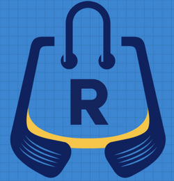

# Tienda-R - Proyecto de E-commerce

Tienda-R es un proyecto de comercio electrónico desarrollado con tecnologías modernas como React, Vite y Bulma CSS. Ofrece una plataforma de compras de ropa y accesorios. Los usuarios pueden explorar productos, agregarlos al carrito y realizar compras.
Este README proporciona información sobre la estructura del proyecto, cómo iniciar la aplicación y cualquier otra información relevante para el desarrollo y la colaboración.

## Características Principales

- Catálogo de productos dividido en secciones de ropa de hombre, mujer y bijouterie.
- Páginas individuales de productos con detalles y opciones de compra.
- Carrito de compras que permite agregar, modificar y eliminar productos.
- Proceso de pago simple para finalizar las compras.

## Tecnologías Utilizadas

- **React:** Utilizamos React como biblioteca principal para construir interfaces de usuario interactivas.
- **Vite:** Vite es el entorno de desarrollo rápido para proyectos web modernos. Proporciona un tiempo de compilación y recarga en caliente ultrarrápidos.
- **Bulma CSS**: Bulma es un marco CSS basado en flexbox que facilita el diseño y la creación de interfaces atractivas y receptivas.
- **Firebase**: Para la gestión de productos y datos relacionados.
- **Vercel**: Plataforma unificada en la nube que permite a los desarrolladores desplegar, gestionar y escalar sus aplicaciones y sitios web.

## Requisitos Previos

Asegúrate de tener instalado Node.js en tu máquina antes de comenzar. Puedes descargarlo desde [nodejs.org](https://nodejs.org/).

## Configuración del Proyecto

1. Clona este repositorio:

   ```bash
   git clone https://github.com/tuUsuarioGit/tienda-R.git
   cd Tienda-R
   ```

2. Instala las dependencias:
   ```bash
   npm install
   ```

## Desarrollo

Para iniciar el servidor de desarrollo, ejecuta:

```bash
npm run dev
```

Esto abrirá la aplicación en tu navegador predeterminado en http://localhost:5173/

## Variables de entorno

Para poder correr la aplicación en tu entorno local, deberás solicitar las variables de entorno al mail renzorocca86@gmail.com.

## Sitio publicado en producción

La app productiva se encuentra publicada [aquí](https://tienda-r.vercel.app)

## Licencia

Este proyecto está bajo Copyright perteneciente a Renzo Rocca.
